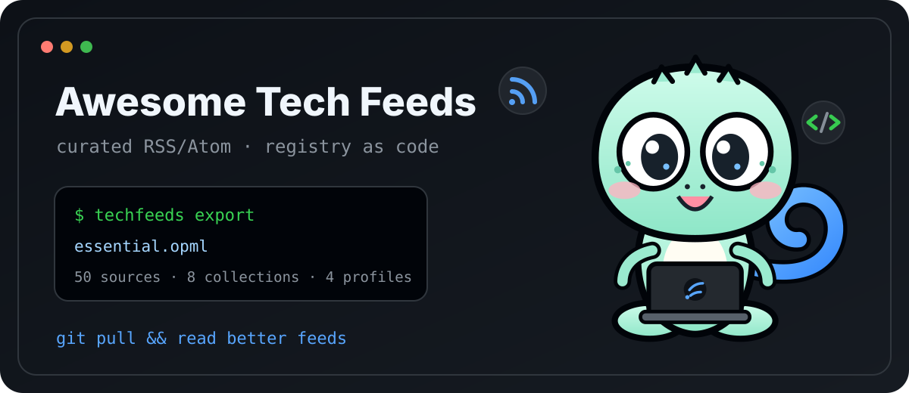

<div align="center">



# Awesome Tech Feeds

**RSS, but treated like infrastructure.**

A Git-native registry of technical RSS/Atom feeds with stable IDs, curated collections, deterministic builds, health probes, a CLI, and a typed Python API.

[](https://github.com/GeoGeekLab/awesome-tech-feeds/actions/workflows/ci.yml)
[](https://github.com/GeoGeekLab/awesome-tech-feeds/actions/workflows/feed-health.yml)
[](pyproject.toml)
[](CHANGELOG.md)
[](LICENSE)
[](DATA-LICENSE.md)

[Catalog](generated/catalog.md) · [Registry JSON](generated/registry.json) · [Essential OPML](generated/essential.opml) · [SDK](docs/consumer-sdk.md) · [Curation](docs/curation.md) · [Contributing](CONTRIBUTING.md)

</div>

## `tl;dr`

The repo currently ships **50 sources**, **8 collections**, and **4 profiles**. The `essential` collection is an intentionally small **18-source** starter pack.

```console
$ techfeeds export --collection essential --format opml -o essential.opml
$ techfeeds export --topic security --trait independent --format json
$ techfeeds profile developer --registry generated/registry.json --format opml -o developer.opml
```

Want the raw data? Start with [`generated/registry.json`](generated/registry.json). Want something your feed reader can import? Grab an OPML file from [`generated/`](generated/).

## Why this is a repo instead of a spreadsheet

A feed URL is easy to collect. Keeping a useful registry alive is the hard part: domains move, endpoints drift, duplicates appear, taxonomies rot, and hand-edited exports diverge.

Awesome Tech Feeds keeps the source of truth reviewable in Git and compiles consumer artifacts from it.

```text
sources/*.yaml ───────┐
collections/*.yaml ───┼──> validate ──> compile ──> generated/registry.json
profiles/*.yaml ──────┘                         ├──> generated/*.opml
                                                └──> generated/catalog.md

scheduled probe ────────────────────────────────────> health.json release asset
```

The useful invariants are deliberately boring:

```text
source.id        = durable identity
feed.url         = transport endpoint
collection       = curated bundle
profile          = executable preset
generated/       = build output
health snapshot  = network observation
```

That makes changes diffable, CI-checkable, and easy to consume without running a service.

## Quick start

For a local checkout:

```bash
git clone https://github.com/GeoGeekLab/awesome-tech-feeds.git
cd awesome-tech-feeds
python -m venv .venv
source .venv/bin/activate
python -m pip install -e '.[dev]'

techfeeds validate
techfeeds compile --check
pytest
```

For the published v0.5 package:

```bash
python -m pip install \
  https://github.com/GeoGeekLab/awesome-tech-feeds/releases/download/v0.5.0/awesome_tech_feeds-0.5.0-py3-none-any.whl
```

## Use the registry

Export exactly what you need instead of maintaining your own pile of feed URLs.

```bash
# Starter pack for a feed reader
techfeeds export --collection essential --format opml -o essential.opml

# Independent security writing as JSON
techfeeds export --topic security --trait independent --format json

# Topic filters compose with AND semantics
techfeeds export --topic ai --topic llm --trait research --format json
```

Filters cover collection, topic, trait, language, and source kind. Unknown values fail explicitly.

The built-in collections are:

`essential` · `ai` · `systems` · `security` · `databases` · `programming-languages` · `company-engineering` · `independent`

Every collection is ordinary YAML under [`collections/`](collections/) and compiles to an importable OPML artifact.

## Query it from Python

```python
from techfeeds import Query, Registry

registry = Registry.from_url()
result = registry.query(
    Query(
        collection="essential",
        topics=("ai",),
        traits=("research",),
    )
)

for source in result.sources:
    print(source.id, source.website)
```

For pinned workflows, verify a downloaded registry before parsing it:

```python
registry = Registry.from_file(
    "registry.json",
    expected_sha256="<digest from SHA256SUMS>",
)
```

The consumer surface is documented in [`docs/consumer-sdk.md`](docs/consumer-sdk.md).

## Source records are code-reviewable data

A source gets a permanent ID; the website and feed URLs can change around it.

```yaml
schema_version: 2
id: simon-willison
name: "Simon Willison’s Weblog"
kind: individual
language: en
website: https://simonwillison.net/
feeds:
  - url: https://simonwillison.net/atom/everything/
    format: atom
    role: primary
    official: true
topics: [ai, llm, python, databases, web]
traits: [original, practitioner, deep-dive, independent, high-frequency]
curation:
  rationale: "Admitted for recurring practitioner writing with reproducible technical detail."
  reviewer: GeoGeekLab
  reviewed_at: "2026-09-20"
  review_after: "2026-12-19"
provenance:
  added_by: GeoGeekLab
  added_at: "2026-09-20"
status: active
```

Field-level rules live in [`docs/registry.md`](docs/registry.md). Curation rules live in [`docs/curation.md`](docs/curation.md).

## Profiles are presets

Profiles turn the same registry into role-oriented starting points:

```text
developer
ai-engineer
founder
researcher
```

They are versioned YAML. A profile selects collections, applies explicit exclusions and boosts, and resolves deterministically.

```bash
techfeeds profile researcher --registry generated/registry.json
techfeeds profile developer --registry generated/registry.json --format opml -o developer.opml
```

See [`docs/profiles.md`](docs/profiles.md) for the v2 profile contract.

## Feed health

Network checks are kept out of the editorial source records.

```bash
techfeeds probe --concurrency 8
```

The scheduled workflow publishes the latest snapshot as a stable release asset:

```text
https://github.com/GeoGeekLab/awesome-tech-feeds/releases/download/health-latest/health.json
```

Probe states are intentionally operational: `healthy`, `degraded`, `stale`, and `broken`. They describe what happened when the endpoint was checked; the registry remains the curated source of truth.

## Generated artifacts

`generated/` is committed build output, so consumers can use the project with `curl`, a feed reader, Python, or plain Git.

| Artifact | Use it for |
| --- | --- |
| [`registry.json`](generated/registry.json) | Full machine-readable registry |
| [`registry.min.json`](generated/registry.min.json) | Compact client payload |
| [`all.opml`](generated/all.opml) | All active primary feeds |
| [`essential.opml`](generated/essential.opml) | Small starter pack |
| `profile-*.json` | Resolved profile output |
| `profile-*.opml` | Feed-reader imports for profiles |
| [`catalog.md`](generated/catalog.md) | Human-readable catalog |

## Repository map

```text
.
├── sources/       # source records
├── collections/   # curated bundles
├── profiles/      # role presets
├── registry/      # controlled vocabularies
├── schema/        # JSON Schemas
├── src/techfeeds/ # CLI + validator + compiler + SDK + probe
├── generated/     # compiled JSON / OPML / catalog
├── tests/         # contract tests
├── docs/          # design + contracts
└── brand/         # Geo Gecko + project artwork
```

## Send a PR

A good source PR answers three practical questions: who publishes it, why it is repeatedly useful, and where the canonical feed lives. Put that evidence in the source record; CI handles the mechanical checks.

```bash
techfeeds validate
techfeeds compile --check
pytest
```

Start with [`CONTRIBUTING.md`](CONTRIBUTING.md). For larger behavior or schema changes, read [`docs/architecture.md`](docs/architecture.md) first.

## Scope

This repository owns source metadata, feed endpoints, curated bundles, deterministic exports, and endpoint health observations. Article fetching, summarization, ranking, delivery, and reader-specific behavior belong in downstream consumers built on top of the registry.

## License

Code and tooling: [MIT](LICENSE). Registry metadata: [CC BY-SA 4.0](DATA-LICENSE.md).

---

<div align="center">

`git pull && read better feeds`

[Geo Gecko](brand/mascot/README.md) · [Changelog](CHANGELOG.md) · [Issues](https://github.com/GeoGeekLab/awesome-tech-feeds/issues)

</div>
